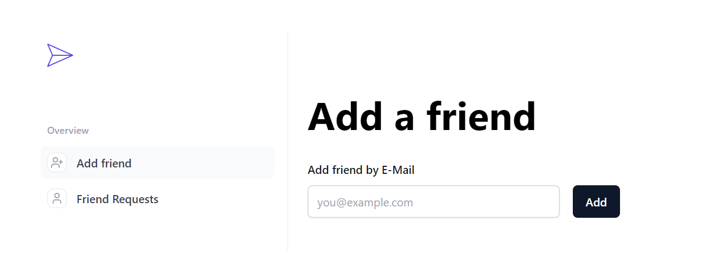

# Realtime Chat App



This README.md provides information on the project, the way to setup it on your machine as well as some of my ideas on how to improve the app. 

## Overview
This is a serverless realtime chat application created with Next.js v13.2.4 and Typescript. I used Upstash Redis to store my data and Pusher to achieve
live realtime state updates.

## Quickstart
Your project root contains .env.example file that you can use to create your .env file.

Upstash: go to [https://upstash.com](https://upstash.com) and create your own Redis database instance to get UPSTASH_REDIS_REST_URL and UPSTASH_REDIS_REST_TOKEN.

Google: At this point the App only supports google auth, so you need to get GOOGLE_CLIENT_ID and GOOGLE_CLIENT_SECRET.

Go to [https://console.cloud.google.com](https://console.cloud.google.com), create a new project and obtain the data required. There are a lot of guides on how to do that out there in the internet, for example you can use this youtube video: [starting from 7:00](https://youtu.be/AbUVY16P4Ys?si=pzYgIXNE0_5VnBZ6)

Pusher: [https://pusher.com/](https://pusher.com/), sign in and get your credentials there.

Run:

```
yarn install
```
to install all of the dependencies, and then:
```
yarn dev
```
to start dev server.

Open [http://localhost:3000](http://localhost:3000) with your browser to see the result.

Run:
```
yarn build
```
to build the application

## Possible improvements

- Login with username and password
- Login with other providers(Github etc)
- Adding tests?
- Remove friend from friend list after addition
- Block user(wherein not removing him from friend list)
- Better error handling (possibly monads); also extracting some error handling into a sep. function would
most likely be a good idea
- Add emotions
- Extending the app with calls, recordings, video-calls.
